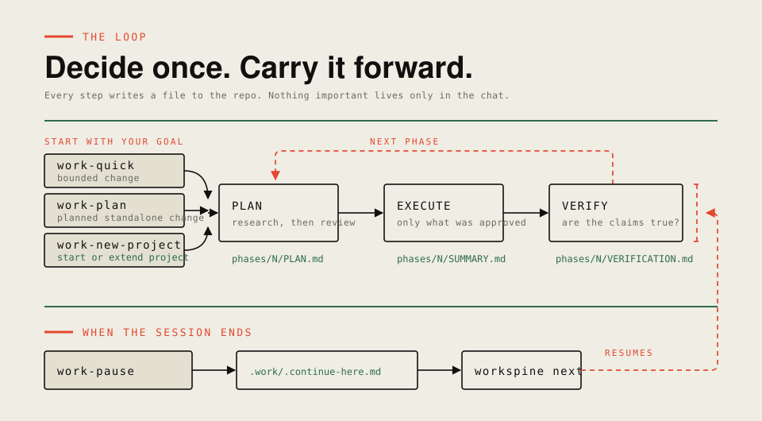
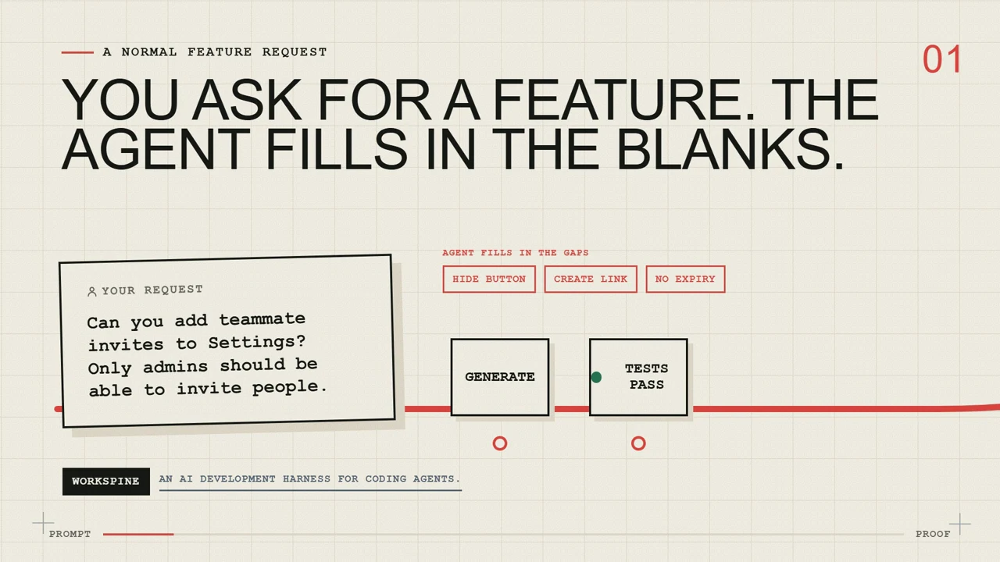
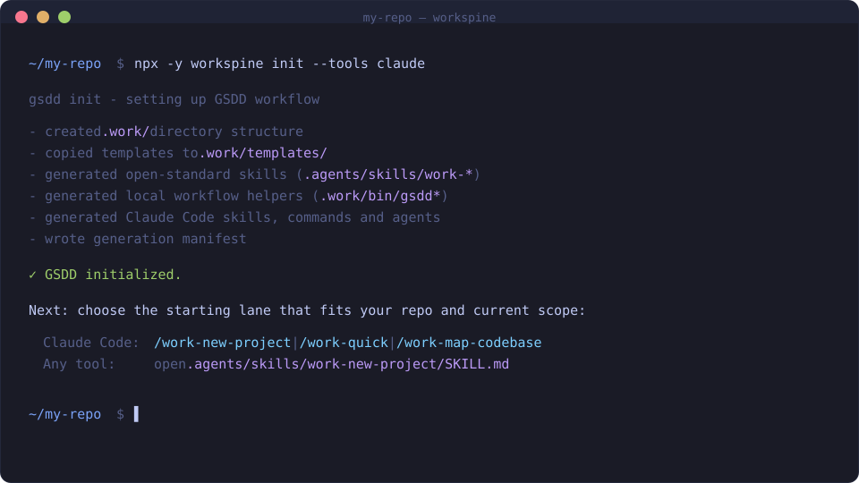

<div align="center">

# Workspine

Workspine is a harness for AI coding agents. It runs a spec-driven loop around your agent (plan, execute, verify) and every step lands as a file in the repo. Your agent writes down what it decided and why, so the next session or a different tool can pick the work back up.

One end-to-end run is recorded, on Codex CLI: plan, execute, a verification catch, a fix, then a passing re-check. Claude Code, OpenCode, Cursor, Copilot or Gemini read the same skill files, with no run of theirs recorded here.

[](https://www.npmjs.com/package/workspine)
[](LICENSE)



```bash
npx -y workspine init
```

Needs Node >=22. The npm package is `workspine`, and it installs two equivalent commands, `workspine` and `gsdd`. The workflows are `work-*` and the workspace is `.work/`; Workspine kept the `gsdd` command and the `.work/` workspace so existing installs keep working. Releases up to 0.32.0 shipped under a different, now-retired npm package name; see CHANGELOG.md for that history. The `gsdd` binary alias is removed at the next minor release, so new scripts should call `workspine` directly.

</div>

---

## What This Is

Workspine gives coding agents a durable workflow for work that spans sessions, agents, or runtimes. There is no hosted service; it writes portable planning and proof artifacts into the repo.

Workspine began as a fork of Get Shit Done and keeps the verification-first workflow while stripping runtime lock-in.

---

## How it works



`init` puts workflow skills in `.agents/skills/` and native adapters for the runtimes you choose. You run those workflows through your agent, and each one writes a file.

There are two ways in. `work-quick` takes a bounded change you can already describe and needs no spec or roadmap. `work-new-project` sets up a spec and phases when the work is fuzzy or milestone-shaped. Both end up in the same loop: plan, execute, verify.

| Workflow | Writes | What for |
|----------|--------|----------|
| `work-quick` | `.work/quick/NNN-slug/` | A bounded change, planned and executed in one pass |
| `work-map-codebase` | `.work/codebase/` | A baseline of an unfamiliar repo before you pick a lane |
| `work-new-project` | `.work/SPEC.md`, `ROADMAP.md` | Define the project and its phases |
| `work-plan` | `.work/phases/N/PLAN.md` | Research and review before any code gets written |
| `work-execute` | `.work/phases/N/SUMMARY.md` | Implement the approved plan, nothing more |
| `work-verify` | `.work/phases/N/VERIFICATION.md` | Confirm the plan's claims are actually true |

Plan first, execute only what was approved, verify before closing. Each summary carries what was decided into the next session, so nobody restarts from scratch.

Stopping mid-phase? Run `work-pause` to write a checkpoint at `.work/.continue-here.md`. `gsdd next` reads it along with `.work/` and repo state, then returns a read-only packet naming the next action. Plain `gsdd next` never creates a background compaction or automatic context-transfer hook.

Workspine ships 13 workflows; the [User Guide](docs/USER-GUIDE.md) lists them all.

---

## Getting Started

`npx -y workspine init` in a terminal opens a guided install wizard: pick your runtimes, choose whether to add a repo-wide `AGENTS.md` governance block, then set planning defaults. `gsdd init` is the shorthand once the package is installed globally.

Whatever you pick, `init` always writes:

- `.work/` is the durable workspace holding templates, role contracts, and config.
- `.agents/skills/work-*` are the portable workflow entry points your agent reads.
- `.work/bin/gsdd.mjs` is generated internal workflow plumbing, not a second public package CLI. Generated skills call it from the repo root.



The wizard only controls the native adapters and the governance block. After that, `npx -y workspine health` checks the generated files against current render output instead of asking you to trust manual review.

Then pick a first workflow:

- `work-new-project` for greenfield, fuzzy, or milestone-shaped work
- `work-quick` for a bounded change you can already describe
- `work-map-codebase` when the repo is unfamiliar and you want a baseline first

### Quickstart (after init)

- Claude Code / OpenCode: slash commands such as `/work-plan`.
- Codex CLI: portable `work-plan` skill reference (`$work-plan`), with `.codex/agents/work-plan-checker.toml` for native checker isolation.
- Cursor / Copilot / Gemini: Use slash commands if your tool discovers `.agents/skills`; if it does not, open `.agents/skills/work-<workflow>/SKILL.md`.

For CI or scripted setup:

```bash
npx -y workspine init --auto --tools all
npx -y workspine init --auto --tools codex --brief path/to/brief.md
```

`init --auto` skips the wizard and takes defaults. With `--brief`, `work-new-project` bootstraps `SPEC.md` and `ROADMAP.md` from that document, then stops. The `--auto` on `install --global` means something else, described below.

### Proof

The proof pack records a full plan -> execute -> verify lifecycle on a real consumer project, with Codex checker support. Recorded path: Codex CLI. Claude Code, OpenCode, Cursor, Copilot or Gemini CLI can read the same `.agents/skills/` surface when their discovery sees it; no run of theirs is recorded here.

- [Brownfield proof](docs/BROWNFIELD-PROOF.md)
- [Tracked consumer proof pack](docs/proof/consumer-node-cli/README.md)

### Global Agent Install

To make Workspine available across repos from your personal agent home:

```bash
npx -y workspine install --global
npx -y workspine install --global --auto
npx -y workspine install --global --tools claude,opencode,codex,copilot
```

For a fresh install, pick targets in the interactive picker or pass `--tools <targets>`. Use `--auto` to refresh detected existing agent homes; when it detects none it writes nothing and prints one exact command per target. It does not create `.work/` in the current repo.

GitHub Copilot CLI installs as a qualified target, with no recorded lifecycle proof. The [User Guide](docs/USER-GUIDE.md) lists the exact directories each target writes to.

### Team Use

Commit `.work/` so the team shares specs, roadmaps, phase plans, and verification reports. Set `commitDocs` in `.work/config.json` to control whether doc changes are expected during workflow execution. Each developer runs `init --tools <their-tool>` for their own adapters.

### What to Track in Git

Track `.work/` and `.agents/skills/`, plus whichever runtime adapters your team relies on.

Leave `.work/.local/` untracked, along with mutable runtime files such as `state.json`, graph logs, open questions, evidence manifests, handoff notes, and raw dogfood drafts.

---

## Configuration

Model profiles choose model cost and quality. Rigor is a separate configuration axis for workflow alignment and quality gates:

```bash
npx -y workspine models profile quality   # maximize model quality
npx -y workspine models profile balanced  # default cost/quality balance
npx -y workspine models profile budget    # minimize model cost
npx -y workspine rigor                    # inspect configuration and effective rigor gates
npx -y workspine rigor high               # update configuration to the high rigor gates
```

`gsdd rigor` inspects or updates configuration.

## Troubleshooting

Inside a repo-local `.work/` workspace, start with `npx -y workspine health`. It compares generated runtime surfaces against current render output and prints the exact repair command, usually `npx -y workspine update --tools <adapter>`.

To repair or refresh a global install, run `npx -y workspine install --global --tools <targets>`, or `--auto` for a detected existing install. It restores managed files you deleted and rewrites stale ones you have not touched, and it never overwrites your edits. If a managed file was hand-edited, or an untracked file sits where a managed one belongs, preflight stops and names it, and nothing is written for any selected target until you fix it.

More cases: [User Guide](docs/USER-GUIDE.md).

---

## Where it fits

Use Workspine when a feature takes more than one session, or when a task has to move between agents. Skip it for quick, obvious edits; direct prompting is cheaper when the risk is small.

| Tool | Good for | vs Workspine |
|------|----------|--------------|
| **Workspine** | Multi-session, multi-agent work where plans and proof stay in the repo | — |
| [GSD](https://github.com/gsd-build/get-shit-done) | Broad AI prompting suite: 81 commands, 78 workflows, 33 agents | Workspine is narrower: 13 workflows |
| [OpenSpec](https://openspec.dev/) | Living spec plus change proposals | Workspine adds execution and verification |
| [LeanSpec](https://www.lean-spec.dev/docs/guide/first-principles) | Minimal specs that fit LLM context | Workspine adds gates and runtime entry points |
| [GitHub Spec Kit](https://github.com/github/spec-kit) | Spec-first planning workflows in `.specify/` | Workspine is one CLI with one delivery loop |
| [Kiro](https://kiro.dev/docs/) | IDE-native agent dev with specs, steering, hooks, MCP | Kiro is IDE-only; Workspine suits any agent that reads repo files |
| [Tessl](https://tessl.io/enterprise/) | Hosted distribution of agent skills across teams | Tessl needs a hosted service; Workspine is local-first |

<sub>From each tool's public docs as of May 2026. Open an issue if anything reads inaccurately.</sub>

---

## CLI

```bash
npx -y workspine health                  # workspace integrity check
npx -y workspine update                  # regenerate stale runtime surfaces
npx -y workspine update --templates      # also refresh template payloads
npx -y workspine next --json             # what to do next, read from .work
npx -y workspine next --format human     # compact supervisor card
npx -y workspine next --init             # bootstrap .work continuity state
npx -y workspine git-identity check      # read-only identity check before a commit
npx -y workspine rigor                   # inspect or update rigor configuration
npx -y workspine models profile quality  # prefer model quality
npx -y workspine models profile budget   # minimize cost
npx -y workspine find-phase              # locate a roadmap phase
npx -y workspine phase-status            # inspect or update phase status
npx -y workspine verify                  # run verification checks
npx -y workspine scaffold                # scaffold planning surfaces
npx -y workspine file-op                 # repo-local copy/delete helper
npx -y workspine help                    # print command help
npx -y workspine journey                 # milestone and phase delivery record # (experimental)
npx -y workspine remember "Use direct commits" --type rule --scope repo # (experimental)
npx -y workspine decisions query "current git flow" --path bin/gsdd.mjs # (experimental)
npx -y workspine decisions promote <id> --authority owner --approval-ref <non-sensitive-ref> # (experimental)
npx -y workspine decisions reject <id> --reason "No longer applicable" # (experimental)
npx -y workspine decisions invalidate <id> --reason "Superseded by the current policy" # (experimental)
```

Decision promotion is a cooperative, auditable owner assertion rather than human authentication. The [User Guide](docs/USER-GUIDE.md) has the record format.

Commands that already write to `.work/` check npm for a newer version and print one line. Read-only commands, `next` and `verify` among them, never reach the network and never write the cache. The check is anonymous, times out after two seconds, and sends no credentials or repository data. A failed check stays silent. Its cache under `.work/.local` is best-effort, with no lock and no cross-process concurrency guarantee. Opt out with `--no-update-notice` or `GSDD_UPDATE_AWARENESS=0`. `health` and `update` are network-free; run `npx -y workspine update` for an explicit repair.

Full reference: [User Guide](docs/USER-GUIDE.md) · [Runtime Support](docs/RUNTIME-SUPPORT.md) · [Verification Discipline](docs/VERIFICATION-DISCIPLINE.md)

---

## Credits

Fork of [Get Shit Done](https://github.com/gsd-build/get-shit-done) by [Lex Christopherson](https://github.com/glittercowboy), MIT licensed. Original git history retained.

MIT License. See [LICENSE](LICENSE) for details.
