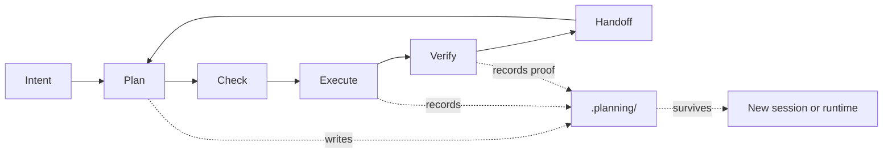
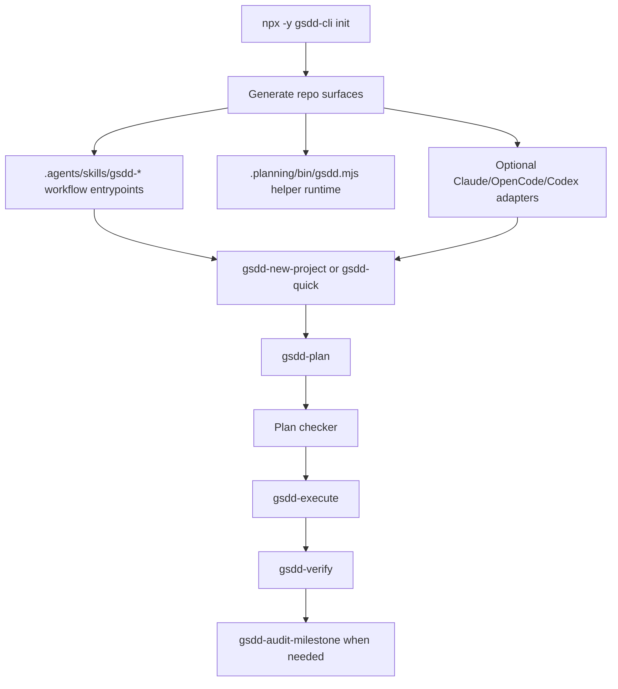

<div align="center">

# Workspine

**For the moment after "the agent can write code" stops being enough.**

Workspine is a repo-native delivery spine for planning, checking, execution, verification, and handoff of AI-assisted software work.

[](https://www.npmjs.com/package/gsdd-cli)
[](LICENSE)

```bash
npx -y gsdd-cli init
```

**Directly validated in this release:** Claude Code, Codex CLI, and OpenCode.

**Qualified support:** Cursor, Copilot, and Gemini CLI can use the shared `.agents/skills/` surface when their skill or slash discovery sees it; this release does not claim the same runtime proof or ergonomics.

</div>

---

## What This Is

AI agents made code cheaper to produce. The scarce part is now the work around the code: choosing the right approach, fitting the existing architecture, reviewing the plan, proving the result, and preserving enough context for the next session.

Workspine keeps that delivery loop in the repo instead of in a chat transcript. It does not replace your coding agent, editor, issue tracker, or review process. It gives them one durable path:



Workspine is the product name. The package, CLI commands, workflow prefixes, and workspace directory remain `gsdd-cli`, `gsdd`, `gsdd-*`, and `.planning/`; these are retained technical contracts, not rename residue.

Workspine began as a fork of [Get Shit Done](https://github.com/gsd-build/get-shit-done). GSD proved the long-horizon delivery problem was real. Workspine keeps the delivery spine and narrows the surface around repo-native state, generated runtime entrypoints, and evidence-gated closure.

---

## Where It Fits

| Tool | Best at | Durable truth lives in | Workspine differs by |
|------|---------|------------------------|----------------------|
| **Workspine** | Multi-session delivery where plans, proof, and handoff must survive agent/runtime switches | `.planning/`, `.agents/skills/`, optional native adapters | Owning the `plan -> execute -> verify` delivery spine with repo-local proof and deterministic health/update checks |
| [**GSD**](https://github.com/gsd-build/get-shit-done) | Broad meta-prompting and context-engineering workflow suite | `.planning/` plus many runtime command surfaces | Staying narrower: fewer public workflow surfaces, stricter closure, less command ceremony |
| [**OpenSpec**](https://openspec.dev/) | Lightweight spec-driven change proposals and living requirement deltas | `openspec/specs/` and `openspec/changes/` | Treating specs as part of a full delivery loop, not only a planning/change layer |
| [**LeanSpec**](https://www.lean-spec.dev/docs/guide/first-principles) | Minimal, maintainable specs that fit human and AI working memory | Small spec/status docs | Adding explicit workflow gates, runtime entrypoints, verification, and handoff when the work needs more structure |
| [**GitHub Spec Kit**](https://github.com/github/spec-kit) | Spec-first creation of specs, plans, tasks, and implementation workflows | `.specify/` artifacts and generated workflow files | Favoring a smaller repo-native delivery spine over a broad spec-tooling ecosystem |
| [**Kiro**](https://kiro.dev/docs/) | Native agentic IDE flow with specs, steering, hooks, chat, MCP, and privacy controls | Kiro project surfaces | Remaining tool-agnostic and usable across terminal/IDE agents that can read repo files |
| [**Tessl**](https://tessl.io/enterprise/) | Enterprise agent skills, evaluated context, distribution, and continuous improvement | Tessl-managed skill/context platform | Staying local-first: no hosted control plane, no org-wide skill registry required |

Use Workspine when the change spans files, sessions, agents, or runtimes; when architecture, security, data, migrations, or release confidence matter; or when proof needs to live in the repo. Skip the full lifecycle for tiny, obvious edits. Direct prompting is cheaper when the risk is genuinely small.

---

## How It Works



The core loop is intentionally small:

| Step | What happens | Artifact |
|------|--------------|----------|
| `gsdd-new-project` | Questions, optional brownfield mapping, research, spec, roadmap | `.planning/SPEC.md`, `.planning/ROADMAP.md` |
| `gsdd-plan` | Researches and writes a reviewed phase plan. Planning stops here. | `.planning/phases/*/PLAN.md` |
| `gsdd-execute` | Implements the approved plan and records what changed. | `.planning/phases/*/SUMMARY.md` |
| `gsdd-verify` | Checks existence, substance, wiring, and proof gaps. | `.planning/phases/*/VERIFICATION.md` |

For bounded existing-code work, start with `gsdd-quick`. For unfamiliar or risky brownfield repos, run `gsdd-map-codebase` before choosing `gsdd-quick` or `gsdd-new-project`.

Workspine ships 14 workflows: `new-project`, `map-codebase`, `plan`, `execute`, `verify`, `verify-work`, `audit-milestone`, `complete-milestone`, `new-milestone`, `plan-milestone-gaps`, `quick`, `pause`, `resume`, and `progress`.

---

## Getting Started

Run the guided install wizard from the repo root:

```bash
npx -y gsdd-cli init
```

It creates:

- `.planning/`: durable project state, templates, role contracts, config, and helper runtime
- `.agents/skills/gsdd-*`: compact workflow entry surface for agents
- `.planning/bin/gsdd.mjs`: repo-local helper runtime for deterministic workflow mechanics
- optional native adapters for Claude Code, OpenCode, and Codex CLI
- optional root `AGENTS.md` governance when you explicitly choose it

### Quickstart

After init, invoke workflows through your agent runtime:

| Runtime | Preferred invocation | Fallback |
|---------|----------------------|----------|
| Claude Code / OpenCode | `/gsdd-plan` slash command | Open `.agents/skills/gsdd-plan/SKILL.md` |
| Codex CLI | `$gsdd-plan` skill reference | Open `.agents/skills/gsdd-plan/SKILL.md` |
| Codex VS Code / Codex app | Native discovery if available | Open or paste `.agents/skills/gsdd-plan/SKILL.md` |
| Cursor / Copilot / Gemini | Use slash commands if your tool discovers `/gsdd-plan` when skill/slash discovery is available | If it does not, open `.agents/skills/gsdd-<workflow>/SKILL.md` |
| Other AI tools | Open the relevant `.agents/skills/gsdd-<workflow>/SKILL.md` | Paste or reference it in the agent chat |

For a full project or broad brownfield effort:

1. Run `npx -y gsdd-cli init`.
2. Start `gsdd-new-project`.
3. Review `gsdd-plan`.
4. Start `gsdd-execute` only when implementation is explicitly approved.
5. Run `gsdd-verify` before calling the phase done.

Headless setup is available for CI or scripted bootstrap:

```bash
npx -y gsdd-cli init --auto --tools claude
npx -y gsdd-cli init --auto --tools claude --brief path/to/PRD.md
```

`--auto` skips the wizard. It does not run downstream workflows. `--brief` copies a starting document into `.planning/PROJECT_BRIEF.md`.

### Team Use

Set `commitDocs: true` to track `.planning/` in git so the team shares the same spec, roadmap, phase plans, and verification reports. Each developer can run `npx -y gsdd-cli init --tools <their-tool>` to generate their local runtime adapters without changing the shared delivery artifacts.

### What to Track in Git

| Path | Track? | Why |
|------|--------|-----|
| `.planning/` | Yes by default | Shared specs, roadmap, plans, summaries, verification |
| `.agents/skills/` | Yes | Portable workflow entrypoints |
| `.claude/`, `.opencode/`, `.codex/` | Yes when generated | Runtime-specific adapters |
| `AGENTS.md` | Yes if generated | Optional repo governance block |

No secrets or credentials are generated. Set `commitDocs: false` for local-only planning state.

---

## Runtime Support

Launch proof is intentionally split:

- **Directly validated:** Claude Code, Codex CLI, and OpenCode have recorded `plan -> execute -> verify` evidence for the core lifecycle.
- **Qualified support:** Cursor, Copilot, and Gemini CLI can use the shared `.agents/skills/` workflow entry surface when discovery is available.
- **Fallback:** any agent that can read markdown can open the relevant `SKILL.md` file.

Codex CLI uses the portable `gsdd-plan` skill entry plus `.codex/agents/gsdd-plan-checker.toml` for the native checker agent. Codex VS Code and the Codex app are separate surfaces; use native discovery if available, otherwise open or paste the generated skill file.

Generated runtime surfaces are checked against current render output:

```bash
npx -y gsdd-cli health
npx -y gsdd-cli update
```

Use `health` first when something feels wrong. Use `update` to repair generated skills, adapters, templates, and helper-runtime drift. Bare `gsdd health` and `gsdd update` are equivalent only when `gsdd-cli` is globally installed.

See [Runtime Support](docs/RUNTIME-SUPPORT.md) for the release-floor matrix and proof boundaries.

---

## CLI Commands

| Command | What it does |
|---------|--------------|
| `npx -y gsdd-cli init [--tools <platform>]` | Set up `.planning/`, workflow skills, helper runtime, and selected adapters |
| `npx -y gsdd-cli update [--tools <platform>] [--templates]` | Regenerate runtime surfaces; `--templates` refreshes templates and role contracts |
| `npx -y gsdd-cli health [--json]` | Check workspace integrity and generated-surface freshness |
| `npx -y gsdd-cli models [show|profile|set|clear|...]` | Inspect or update model profile and runtime overrides |
| `npx -y gsdd-cli control-map [--json] [--with-ignored]` | Report repo/worktree/planning state and safe next interventions |
| `npx -y gsdd-cli control-map annotate <set|clear>` | Maintain optional local intent annotations |
| `npx -y gsdd-cli closeout-report [--json] [--phase <N>]` | Replay read-only closeout status from existing signals |
| `npx -y gsdd-cli ui-proof validate <path>` | Validate UI proof bundle metadata |
| `npx -y gsdd-cli ui-proof compare <planned-slots-json>` | Compare planned UI proof slots to observed bundles |
| `npx -y gsdd-cli file-op <copy|delete|regex-sub>` | Run deterministic workspace-confined file operations |
| `npx -y gsdd-cli session-fingerprint write` | Rebaseline local planning-state drift after review |
| `npx -y gsdd-cli find-phase [N]` | Show phase info as JSON |
| `npx -y gsdd-cli phase-status <N> <status>` | Update one ROADMAP phase status through the helper |
| `npx -y gsdd-cli verify <N>` | Run deterministic phase artifact checks |
| `npx -y gsdd-cli scaffold phase <N> [name]` | Create a phase plan file |
| `npx -y gsdd-cli help` | Show CLI help |

---

## Configuration

`npx -y gsdd-cli init` creates `.planning/config.json`.

| Setting | Default | What it controls |
|---------|---------|------------------|
| `researchDepth` | `balanced` | Research depth before planning |
| `parallelization` | `true` | Independent agent work where the runtime supports it |
| `commitDocs` | `true` | Whether `.planning/` is intended for git |
| `modelProfile` | `balanced` | Semantic model tier for checker-style work |
| `workflow.research` | `true` | Domain research before planning |
| `workflow.planCheck` | `true` | Fresh-context plan review before execution |
| `workflow.verifier` | `true` | Post-execution verification |

Use `quality` to maximize review rigor for production, security-sensitive, or high-risk work. Use `balanced` for normal development. Use `budget` to minimize cost when the domain is familiar and you will review manually.

Model profile commands:

```bash
npx -y gsdd-cli models show
npx -y gsdd-cli models profile quality
npx -y gsdd-cli models profile budget
```

---

## Docs

- [User Guide](docs/USER-GUIDE.md): workflow diagrams, command reference, examples, and recovery procedures
- [Runtime Support](docs/RUNTIME-SUPPORT.md): direct vs qualified runtime proof
- [Verification Discipline](docs/VERIFICATION-DISCIPLINE.md): what counts as proof
- [Brownfield Proof](docs/BROWNFIELD-PROOF.md): existing-code workflow evidence
- [Consumer proof pack](docs/proof/consumer-node-cli/README.md): release-floor proof export
- [Design Decisions](distilled/DESIGN.md): detailed GSD-to-Workspine rationale

---

## Troubleshooting

First step:

```bash
npx -y gsdd-cli health
```

| Problem | What to do |
|---------|------------|
| Generated runtime command is missing or stale | Run `npx -y gsdd-cli update` |
| Lost track of progress | Run `gsdd-progress` or open the relevant `.agents/skills/gsdd-progress/SKILL.md` |
| Need context from last session | Run `gsdd-resume` |
| Plan looks weak | Keep `workflow.research` and `workflow.planCheck` enabled |
| Costs are too high | Use `npx -y gsdd-cli models profile budget` and reduce workflow toggles deliberately |

For detailed recovery procedures, see the [User Guide](docs/USER-GUIDE.md#troubleshooting).

---

## Credits

Workspine is a fork of [Get Shit Done](https://github.com/gsd-build/get-shit-done) by [Lex Christopherson](https://github.com/glittercowboy), licensed under MIT. Original git history is retained for attribution.

## License

MIT License. See [LICENSE](LICENSE) for details.
